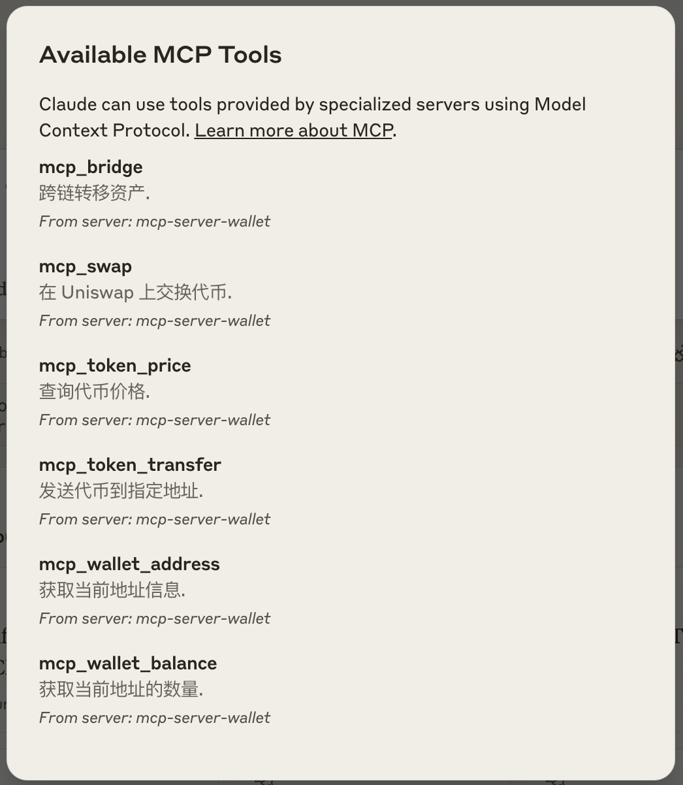
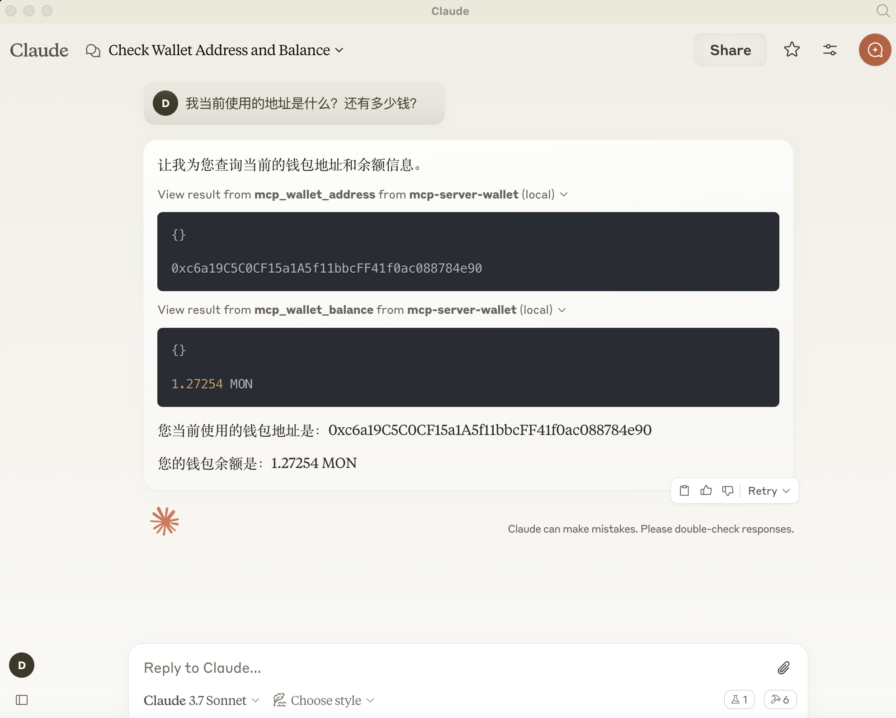
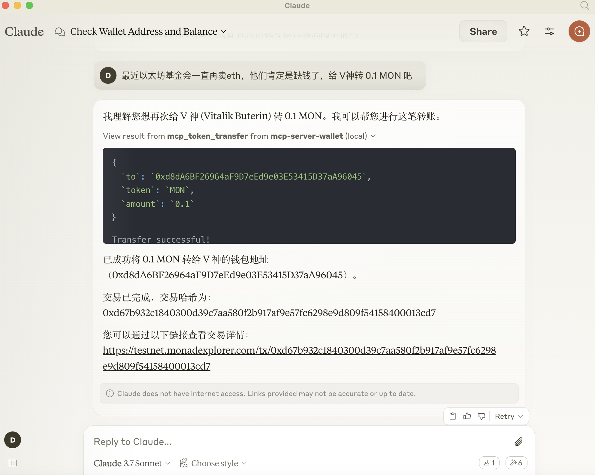
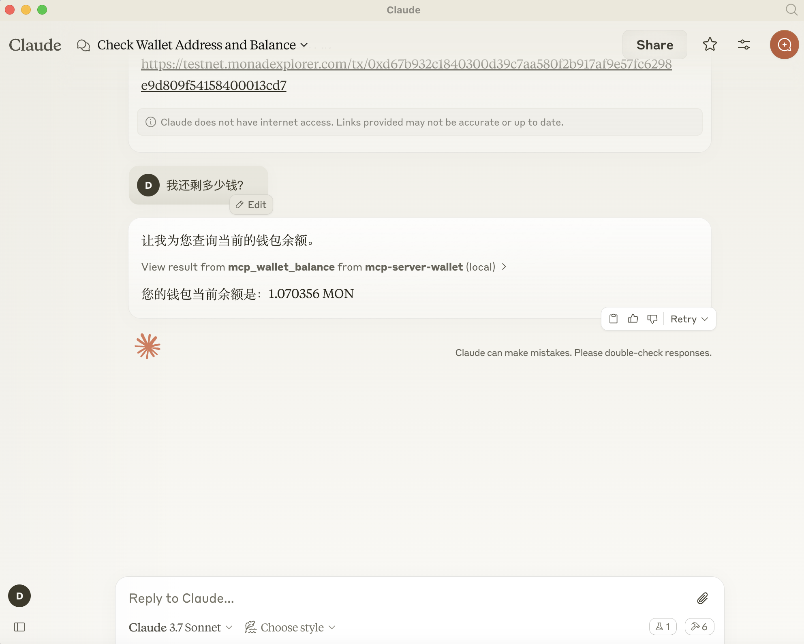

# MCP 钱包

基于 MCP（模型-上下文-协议）的综合性 Web3 钱包 SDK，用于与 Monad 和其他 EVM 兼容区块链交互。该库提供了一个安全、功能丰富的钱包实现，可以集成到任何 JavaScript/TypeScript 应用程序中或直接与支持 MCP 的 AI 助手一起使用。

[English Documentation](./README.md) | [MCP 集成指南](./docs/MCP-INTEGRATION.zh-CN.md)

## 🤖 MCP 集成 - 核心功能

MCP 钱包主要设计用于与支持 MCP 的 AI 助手一起工作。模型上下文协议（MCP）是一种开放标准，它实现了 AI 模型与外部工具（如本钱包）之间的安全、双向连接。

### 什么是 MCP？

MCP（模型-上下文-协议）是一种允许 AI 模型与外部工具和服务交互的协议。在本钱包的上下文中：

- 它使 AI 助手能够安全地帮助用户管理其加密资产
- 它为 LLM 提供了访问钱包功能的标准化方式
- 它维护安全边界以保护私钥和敏感操作

### MCP 功能

本钱包通过 MCP 暴露以下功能：

1. **只读操作**：获取钱包地址、检查余额、查看交易历史
2. **准备操作**：创建交易对象、估算 Gas 费用、建议交换路径
3. **信息服务**：代币价格信息、网络状态、链信息
4. **安全设计**：无法直接访问私钥，交易需要用户确认

### 支持的操作

MCP 钱包通过 MCP 支持以下操作：

#### 基础操作
- 获取钱包地址和余额
- 查看交易历史
- 检查 Gas 价格
- 估算交易费用

#### 代币操作
- 查看 ERC-20 代币余额
- 转账 ERC-20 代币
- 查看 ERC-721 (NFT) 余额
- 转移 NFT
- 获取代币价格和市场数据

#### DeFi 操作
- 通过 Uniswap 进行代币交换
  - MONAD 换取代币
  - 代币之间互换
  - 支持多个 DEX 协议
  - 自定义滑点和截止时间

#### 跨链操作
- 在不同链之间桥接资产
  - 支持 Across Protocol
  - 支持主要 EVM 链（Monad、以太坊、Polygon、Arbitrum、Optimism）
  - 跨链代币转账
  - 桥接费用估算

#### 交易管理
- 创建和准备交易
- Gas 费用估算和优化
- 交易状态监控
- 交易历史追踪

#### 安全操作
- 只读模式安全浏览
- 多方计算 (MPC) 支持
- 交易审批工作流
- 速率限制和访问控制

### 操作示例

以下是通过自然语言提示与钱包交互的示例：

#### 基础操作
```
"查看我的钱包余额"
"显示最近的交易记录"
"当前的 Gas 价格是多少？"
"获取我的钱包地址"
```

#### 代币操作
```
"查看我的 USDC 余额"
"发送 100 USDT 到 0x123..."
"显示我的 NFT 收藏"
"MONAD 的当前价格是多少？"
```

#### DeFi 操作
```
"将 1 个 MONAD 换成 USDC"
"查询用 1000 USDT 换 MONAD 的最佳汇率"
"显示我参与的流动性池"
"计算用 5 MONAD 换 USDC 的滑点"
```

#### 跨链操作
```
"将 1 个 MONAD 从 Monad 转到以太坊"
"查询将 1000 USDC 转到 Monad 的费用"
"显示转到 Optimism 的可用桥接选项"
"追踪我的跨链转账状态"
```

#### 交易管理
```
"创建一笔发送 1 MONAD 的交易"
"估算这笔转账的 Gas 费用"
"查看交易 0x123... 的状态"
"显示我的待处理交易"
```

### 安全考虑

#### 密钥管理
1. **私钥保护**：
   - 永远不要与任何人分享私钥或助记词
   - 将密钥存储在安全的加密存储中
   - 大额资金使用硬件钱包
   - 启用生物识别认证（如可用）

2. **访问控制**：
   - 默认使用只读模式
   - 实施基于角色的访问控制
   - 设置交易限额
   - 大额交易启用多重签名

3. **网络安全**：
   - 使用安全的 RPC 端点
   - 为所有连接实施 SSL/TLS
   - 监控可疑活动
   - 定期安全审计

#### 交易安全
1. **验证步骤**：
   - 始终验证接收地址
   - 仔细检查交易金额
   - 批准前审查 Gas 费用
   - 确认网络/链 ID

2. **智能合约安全**：
   - 验证合约地址
   - 审查合约权限
   - 检查已审计的合约
   - 执行前进行模拟

3. **授权管理**：
   - 定期审查代币授权
   - 设置授权限额
   - 撤销未使用的授权
   - 监控授权过期

#### MPC 安全
1. **多方计算**：
   - 安全分割密钥份额
   - 使用门限签名
   - 实施安全密钥恢复
   - 定期密钥轮换

2. **运营安全**：
   - 使用安全通信渠道
   - 实施超时机制
   - 速率限制
   - 审计日志

#### AI 助手集成
1. **提示安全**：
   - 使用清晰、明确的语言
   - 避免在提示中包含敏感信息
   - 验证 AI 的理解
   - 审查建议的操作

2. **权限管理**：
   - 设置操作限制
   - 定义允许的操作
   - 实施冷却期
   - 定期权限审查

3. **交易审查**：
   - 强制人工验证
   - 清晰的确认对话框
   - 详细的交易预览
   - 始终提供取消选项

## 安装

### 使用 npx 运行

```bash
env MCP_RPC_URL=https://testnet.rpc.monad.xyz MCP_CHAIN_ID=10143 npx -y mcp-wallet-mcp
```

### 全局安装（推荐）

```bash
npm install -g mcp-wallet
# 或
yarn global add mcp-wallet
```

### 本地安装

```bash
npm install mcp-wallet
# 或
yarn add mcp-wallet
```

### 在 Cursor 中运行

配置 Cursor 🖥️
注意：需要 Cursor 版本 0.45.6+

在 Cursor 中配置 MCP 钱包：

1. 打开 Cursor 设置
2. 进入 功能 > MCP 服务器
3. 点击 "+ 添加新 MCP 服务器"
4. 输入以下内容：
   - 名称："mcp-wallet"（或你喜欢的名称）
   - 类型："command"
   - 命令：`env MCP_PRIVATE_KEY=0x... npx -y mcp-wallet-mcp`

> 如果你使用 Windows，请尝试 `cmd /c "set MCP_PRIVATE_KEY=0x... npx -y mcp-wallet-mcp"`

### 在 Windsurf 中运行

将以下内容添加到你的 `./codeium/windsurf/model_config.json` 文件中：

```json
{
  "mcpServers": {
    "mcp-server-wallet": {
      "command": "npx",
      "args": ["-y", "mcp-wallet-mcp"],
      "env": {
        "MCP_PRIVATE_KEY": "0x...",
      }
    }
  }
}
```

### 在 Claude Desktop 中运行

将以下内容添加到你的 `claude_desktop_config.json` 文件中：

```json
{
  "mcpServers": {
    "mcp-server-wallet": {
      "command": "npx",
      "args": ["-y", "mcp-wallet-mcp"],
      "env": {
        "MCP_PRIVATE_KEY": "你的私钥",
      }
    }
  }
}
```

配置完成后，Claude 可以通过自然语言命令与你的钱包交互。

#### Claude 使用说明


*在 Claude 配置成功后展示*


*在 Claude 中查看链接钱包*


*在 Claude 中转移资金*


*在 Claude 中查看钱包余额*

## 环境变量配置

配置 MCP 钱包的推荐方式是通过环境变量：

```bash
# 必需配置
export MCP_RPC_URL="https://rpc.monad.xyz"
export MCP_CHAIN_ID="10143"

# 认证（选择一种）
export MCP_PRIVATE_KEY="0x..." # 用于签名交易的私钥
# 或
export MCP_MNEMONIC="你的十二个助记词" # 用于 HD 钱包的助记词
# 或
export MCP_ADDRESS="0x..." # 只读模式

# 可选配置
export MCP_MPC_ENABLED="true" # 启用多方计算以增强安全性
export MCP_MAX_FEE="50" # 最大 Gas 费用（GWEI）
export MCP_APPROVAL_TIMEOUT="120" # 等待交易批准的秒数
```

## CLI 命令

MCP 钱包提供了命令行界面 (CLI)，允许你从终端与钱包交互：

```bash
# 初始化钱包配置
mcp-wallet init

# 获取钱包地址
mcp-wallet address

# 获取 MONAD 余额
mcp-wallet balance

# 获取代币余额
mcp-wallet token-balance 0x代币合约地址

# 发送 MONAD
mcp-wallet send 0x接收地址 0.1

# 发送代币
mcp-wallet send-token 0x代币合约地址 0x接收地址 100

# 启动 MCP 服务器
mcp-wallet serve
```

## 开发

```bash
# 克隆仓库
git clone https://github.com/dushaobindoudou/mcp-wallet.git
cd mcp-wallet

# 安装依赖
npm install

# 运行测试
npm test

# 构建包
npm run build
```

## 贡献

欢迎贡献！请随时提交 Pull Request。

## 许可证

本项目采用 MIT 许可证 - 详情请参阅 [LICENSE](LICENSE) 文件。